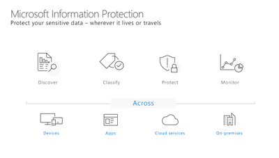
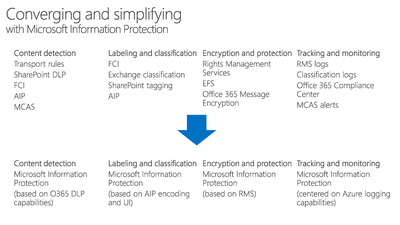
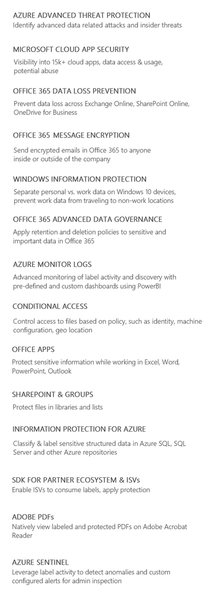

# The Microsoft Information Protection Story

 

**Azure Information Protection** (as described in the introduction) is one part of the larger **Microsoft Information Protection** story.  With Microsoft Information Protection, Microsoft is streamlining how all applications that require information protection capabilities interact.  This provides a **unified interface** where both Microsoft and Partner applications can **classify and protect sensitive information**. 

Ultimately, this means better integration across our information protection solutions and a more consistent approach to protecting your sensitive data.

 

The image below shows examples of technologies that can interface with Microsoft Information Protection. Although we will not delve deeply into all of these technologies in this lab, we will provide resources in the conclusion that may be used for further exposition.  

 

## Where to Begin

With General Availability of Unified Labeling clients and Sensitivity Labels in the Security and Compliance Center, there has been some confusion on where customers should start their deployment and which clients they should use. This is a common question, and one that requires understanding of the capabilities available in the Azure Information Protection client (classic) versus what is currently available in the Azure Information Protection Unified Labeling client. 

### Azure Information Protection unified labeling client 

The **Azure Information Protection unified labeling client** is an Office and Windows addin that pulls labels from the unified labeling store that multiple applications and services support. This client supports the latest advanced features and is recommended for all customers with some minor exceptions noted later. This client downloads sensitivity labels and policy settings from the Office/Microsoft 365 Security & Compliance center. 

### Azure Information Protection client (classic) 

The **Azure Information Protection client (classic)** has been available since Azure Information Protection was first announced as a new service for classifying and protecting files and emails. This client downloads labels and policy settings from Azure, and you configure the Azure Information Protection policy from the Azure portal. 

### Migrating Labels to Unified Labeling

New tenants today have Unified Labeling enabled by default.  For customers that have established tenants, you will be required to do a one time activation to migrate your labels from the Azure label store to the Unified Labeling store.  Migrating these labels **DOES NOT** require that all Azure Information Protection classic clients be upgraded to the Unified Labeling client immediately.  You can activate Unified Labeling today and migrate the clients in a phased manner after full testing has been done.  This also allows you to begin testing and enabling your Mac, mobile, and other services that use the MIP SDK (PowerBI, SharePoint Online, Adobe PDF, DLP, Firewalls, etc...).

In this lab, we will look primarily at the Azure Information Protection unified labeling client because it now has the advanced features necessary for most Enterprise deployments. 

---
In this section, we reviewed the Microsoft Information Protection vision and discussed the differences between the AIP unified labeling client and the AIP client (classic).

In the next section, we will begin our discussion of Microsoft Information Protection with the Discover phase.

[Next - Phase 1: Discover - Endpoints](1.Discovery.md)