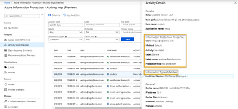

<page title="Phase 1: Discover" />

# Phase 1: Discover - Endpoints


Azure Information Protection can help you to discover sensitive data on local endpoints, CIFS file shares, and on-premises SharePoint sites and libraries.  In this section, we will look at several methods available to begin collecting this useful and actionable data.

## AIP Client Windows Endpoint Auditing

Using the current Azure Information Protection clients, you can now discover sensitive information in any new document that is saved in Office on a machine with the AIP client installed. This will allow you to do passive data discovery across all of your Windows endpoints. You can also do active endpoint auditing with the AIP Unified Labeling client using the PowerShell cmdlets that are installed with the client.



If you have **Microsoft Defender Advanced Threat Protection** (MDATP) deployed to your endpoints, you can also integrate with Information Protection to actively audit sensitive files being accessed on your endpoints. With the risk information provided by MDATP, you can target risky systems and use PowerShell to run a scan of the system to discover sensitive data that may be at risk on those compromised systems (and optionally encrypt that data).  We will demonstrate this type of scan later in this section.

---
## AIP Client Windows Endpoint Auditing - Hands On

In this hands-on section, we will configure the default labels and global policy needed for the AIP unified labeling client to download policy.  Once this is done, we will add sensitive information to a Word document and label it to show passive auditing with the AIP unified labeling client.  Finally we will use the PowerShell cmdlets provided with the AIP unified labeling client to scan an endpoint for sensitive data.

## Default Label Configuration

In this task, we will **Generate default labels** and deploy them to the a **Global** policy in the Microsoft Security Center.

1. Open Edge and browse to **https://aka.ms/AIPConsole**

2. Log in using your Global Admin credentials
3. Under **Classifications** click on **Labels**
4. In the Labels blade, at the top, click the **+ Generate default labels** button.

	

	> You will see an image like the one below once the generation is complete.
	>
	

---
## Configuring Global Policy

We now have default labels available for deployment.  At this point, no users will see these labels until we assign them to a policy.  Deciding what labels to deploy to users to minimize impact is a topic that can raise many concerns. Issues with application compatibility and concerns around when to deploy labels with protection are just a few of these.

Many organizations can deploy protected labels during the initial rollout and train their users in appropriate labeling behaviors.  This has the advantage of only requiring end user training once, but some organizations have found this approach to be too aggressive.

An alternative approach that we have seen be successful is to deploy the top-level labels and only the **Recipients Only** and **Anyone (not protected)** sub-labels initially. This has the benefit of allowing users to get accustomed to classification of content before rolling out additional protected labels. In this workshop, we will deploy all labels at once for simplicity.

We will discuss protection in more detail in the **Protect and control access** section.

---
## Publishing Labels for Unified Labeling Clients

While generating default labels in the Azure Portal, we have also enabled them in the Unified Labeling store in the Security and compliance Center.  However, to prevent these labels from impacting production, they are not published immediately.

In this task, we will publish the labels to a label policy in the Security and Compliance Center. This is necessary for labels to display in Unified Labeling clients and Microsoft Cloud Application Security policies.

1. In a new tab, browse to **https://security.microsoft.com/**
2. On the left side, expand **Classification** and click on **Sensitivity Labels**

	>In the **Labels** section, you will see the default labels configured for the AIP demo tenants. 
	>
	>These demo labels are modeled after the labels that Microsoft uses internally (with the exception of Personal where we use Non-Business) and are highly recommended as a baseline for customers that do not already have an established and effective classification taxonomy. More details on how Microsoft developed this taxonomy and how we deployed AIP internally are available in a video online at https://aka.ms/AIPShowcase. We will list this URL again in the additional resources at the end of the lab.

	>

3. At the top of the page, click on **Label policies**

    >Note that there are no predefined label policies.  Label policies in the Security & Compliance Center are more versatile than policies in the Azure portal because the same labels can be applied in multiple policies.  This allows for a higher level of customization based on group or role. 
4. On the Label policies page, click on **Publish labels**
5. In the New sensitivity label policy, click **Choose sensitivity labels to publish**

	
   
6. In the Sensitivity labels to publish blade, check the **Select All** box and click the **Add** button
7. On the Choose labels to publish page, click the **Next** button
8.  On the Publish to users and groups page, click the **Next** button
9.  On the Policy settings page, click the **Next** button

	>NOTE: We will revisit these settings later in the lab
2. On the Policy settings page, in the **Name** text box, type **Global**
3. Click **Next**
4. On the "Review your settings" page, click **Submit**

	>

---
## Detecting Sensitive Information with the AIP Unified Labeling Client Addin

1. On the desktop, double click on **AdminPC** 
1. Log in using the Credentials below

	> **Contoso\AIPScanner**
	>
	> **Somepass1**
1. Click on the start menu and launch **Word**
2. In the Microsoft Azure Information Protection prompt, type **AlexW@yourdomain.onmicrosoft.com** and click **Next**
3. When prompted, type the password and Sign in
4. In the Sign in to set up Office dialog, click **Sign in**
5. In the Activate Office dialog, type **AlexW@yourdomain.onmicrosoft.com** and click **Connect**.
6.  When prompted, type the password and Sign in
7. Create a new **Blank document**
8. In the new document enter the text **My AMEX card number is 344047014854133. The expiration date is 09/28, and the CVV is 4368** 

	> This card number is a fake number that was generated using the Credit Card Generator for Testing at ```https://developer.paypal.com/developer/creditCardGenerator/```.  The Microsoft Classification Engine uses the Luhn Algorithm to prevent false positives so when testing, please make sure to use valid numbers.
1. Click on the Sensitivity button and manually label the document as **General** and **save the document**.
    >

    >After labeling and saving the file, the AIP unified labeling client installed on this system will detect the credit card that has been entered in this new document and report it up to the AIP Log Analytics portal if it is configured. Note that despite the document being labeled as General, we still see the information type match in the activity details.
    > 
    >

In the Classification section of this workshop, we will configure policy settings including the default label and mandatory labeling which will ensure that you are getting these insights from all of the documents and emails being created on your endpoints.  You can use these insights along with the recommendations panel in log analytics to add conditions to your labels to help guide your users in appropriately classifying their documents and emails.

----
## Active Endpoint Discovery with PowerShell

In this task, we will scan a local directory on the endpoint using AIP PowerShell and the -WhatIf and -DiscoverInfoTypes switches to catalog the sensitive information in that location.  While we will do this manually on the endpoint, this could easily be pushed to the endpoint as a package from SCCM, Intune, or any other client management utility that can send remote commands to the endpoints.

If you combine this functionality with risk profiles from Microsoft Defender ATP, you can quickly target at risk systems and identify (and optionally protect) sensitive data on those endpoints.

>WARNING: This PowerShell command is very resource intensive, so we do not recommend actively scanning all endpoints using this method on an ongoing basis.  This should be seen as a point-in-time remedial and auditing tool when security of your data takes higher precedence than user experience.

1. Click on the Start menu and click **Windows PowerShell**
2. In the PowerShell window, type **Set-AIPFileClassification -Path C:\PII -WhatIf -DiscoveryInfoTypes All | Out-File ~\Desktop\Results.txt**

    >NOTE: To collect the discovered data described in this section of the lab, normally you would configure AIP Analytics in the Azure portal first. We will discuss Monitoring and show how that is configured in a later section. For now, we will export the results to a file so we can review them immediately. 

    >NOTE: You will see one error when running this command on a file in the repository ending in Enrique.docx.  This is expected as this file was encrypted with AIP from the Microsoft tenant and this test tenant does not have rights to inspect this document.

1. On the desktop, double-click on **Results.txt**

    >Review the data collected by the scan.  You will see that although there are many information types discovered in these documents, none of them have been labeled.  If you had automatic conditions applied to your labels or a default label, you would see the label that would be applied if you had not used the -WhatIf parameter.

    >If you have AIP Log Analytics configured, you would also see this information surfaced in your Data Discovery and Activity Logs in the Azure Portal as shown below.
    
    >**Data Discovery**
    >

    >**Activity Logs**
    >


---
In this section, we have discussed and demonstrated Windows Endpoint Discovery methods using the AIP unified labeling client addin and AIP PowerShell.

In the next section, we will show how to install and configure the AIP unified labeling scanner for discovery of sensitive data in repositories.

[Next - Phase 1: Discover - File Repositories](2.DiscoveryRepo.md)