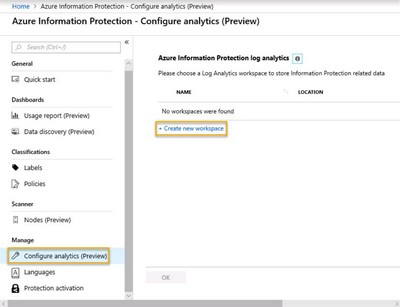
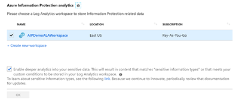
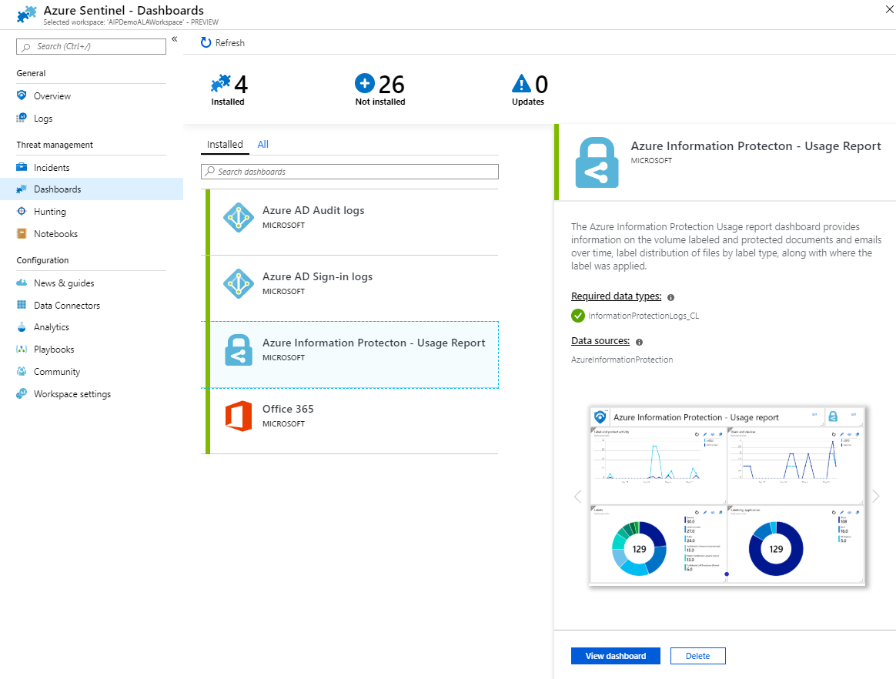

<page title="Monitor and Remediate (Hands On)" />

# Phase 4: Monitor and Remediate (Hands On)

In this section, we will discuss setup of AIP Analytics and the capabilities of Azure Sentinel and Azure Monitor for monitoring and alerting on discovered sensitive data and user activities.

---
## AIP Analytics (Central Reporting)

Normally, before beginning with with Azure Information Protection discovery and protection, you will first configure AIP analytics.  This is done by connecting an existing Azure Log Analytics workspace or creating a new one using the **+ Create new workspace** link. Azure Log Analytics workspaces require an Azure subscription so we will not be able to demonstrate this functionality in this lab, but we will provide instructions for configuring AIP Analytics so you may refer to them in your own tenant with an available subscription.

1. On the jumphost, browse to **https://aka.ms/AIPConsole**

1. In the Azure Information Protection blade, under **Manage**, click **Configure analytics**.

1. Next, click on **+ Create new workspace**.

	

	> Warning: The reason we recommend creating a new workspace here is that, by default, only the creator and subscription administrators have access to an Azure Log Analytics workspace.  
	>
	> The data contained in this workspace will contain details about the **location** and **contents** of files containing **sensitive information**. 
	>
	> Restricting access to this workspace only to **trusted administrators** with a **need to know** is **highly recommended**.

	>NOTE: If you have already set up Azure Sentinel and want to integrate AIP logging, you should use the configured Azure Sentinel Log Analytics workspace.

1. On this blade, you would configure the Log analytics workspace using the values similar to the ones in the table below. **Note that this is not possible in the lab environment because we do not have an active subscription**.

	<table>
	<thead>
	<tr>
	<th>Setting</th>
	<th>Value</th>
	</tr>
	</thead>
	<tbody>
	<tr>
	<td>Log Analytics Workspace</td>
	<td><strong>Type a globally unique Workspace Name</strong></td>
	</tr>
	<tr>
	<td>Resource Group</td>
	<td><strong>Provide a Resource Group Name (unique to tenant), or choose an existing Resource Group</strong></td>
	</tr>
	<tr>
	<td>Location</td>
	<td><strong>Choose a location near the tenant</strong></td>
	</tr>
	<tr>
	<td>Pricing tier</td>
	<td><strong>Per GB</strong></td>
	</tr>
	</tbody>
	</table>

2. Next, back in the Configure analytics blade, you would **check the box** next to the **workspace** and next to **Enable deeper analytics into your sensitive data** and click **OK**.

	 

	>  Checking the box next to **Enable deeper analytics into your sensitive data** allows the **actual matched content** to be stored in the Azure Log Analytics workspace.  This could include many types of sensitive information such as SSN, Credit Card Numbers, and Banking Information.  This option is typically used during testing of automatic conditions and not widely used in production settings due to the sensitive nature of the collected data.  If this is used in a production setting, extreme caution should be taken with securing access to this workspace.

---
## Azure Sentinel

Azure Sentinel is a cloud-native SIEM that provides intelligent security analytics. You can easily collect data from all your cloud or on-premises assets, Office 365, Azure resources, and other clouds.  You can also collect data from any source that can forward logs in Common Event Format (CEF) logs format. This allows you to bring together data points from across your environment for log aggregation, threat detection and visualization.

For Azure Sentinel to integrate with Azure Information Protection, you must connect Azure Sentinel to the same workspace you have configured for AIP.  Once the workspace is connected, you will have access to the **Usage Report** dashboard.

>

By clicking on this dashboard, you will be able to see data similar to what is available through the AIP Analytics dashboards from within Sentinel.  This is useful if you are using Sentinel as your primary SIEM. More dashboards and functionality will be added to Senitnel in the future.

---
In this section, we discussed setup of AIP Analytics and the capabilities of Azure Sentinel for monitoring discovered sensitive data and user activities.

On the next page we will review the contents of the lab and provide some resources for additional learning.

[Next - Conclusion](conclusion.md)
