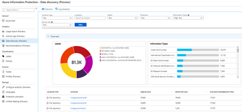
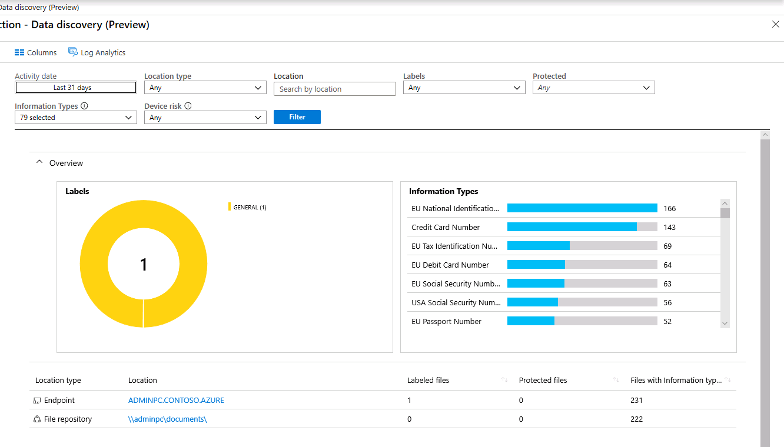

<page title="Discover (Hands On)" />

# Phase 1: Discover - File Repositories

In this section, we will run through the configuration of the AIP unified labeling scanner and show how it can be used to detect sensitive data on repositories.

---
## Azure Information Protection Scanner

Most modern organizations have terabytes (or petabytes) of unstructured data sitting in their on-premises data repositories and SharePoint libraries. Managing this data the way you manage other corporate resources is a daunting but achievable task using tools like the AIP scanner.

The **Azure Information Protection scanner** allows you to scan your on premises data repositories against the standard Office 365 sensitive information types and custom types you build with keywords or regular expressions. Once the data is discovered, the AIP scanner(s) can aggregate the findings and display them in Analytics reports so you can begin visualizing your data risk and see recommendations for setting up protection rules based on the content.

We will quickly walk through the installation of the AIP unified labeling scanner in this lab, but we do the full end-to-end installation with multiple scanners attached to a single profile for load balancing in another lab in this series.

---
## AIP Scanner Configuration

In this task, we will configure an AIP scanner profile in Azure and install an AIP scanner to run in discovery mode. 

1. Minimize **AdminPC** and return to Edge on the jumphost
1. Click on the Azure Information Protection tab
2. Under **Scanner**, click **Profiles**
3. In the Scanner Profiles blade, click the **+ Add** button

4. In the Add a new profile blade, enter <copy>East US</copy> for the **Proflie name**

	>  The default **Schedule** is set to **Manual**, and **Info types to be discovered** is set to **All**.

1. Under **Policy Enforcement**, set the **Enforce** switch to **Off**
1. Click **Save** to complete initial configuration
1. Once the save is complete, click on **Configure repositories**
1. In the Repositories blade, click the **+ Add** button

1. In the Repository blade, under **Path**, type <copy>\\\AdminPC\Documents</copy>
1. In the Repository blade, click **Save**
	
	>NOTE: Keep the Azure Portal window available for future hands on sections.
1. On the desktop, restore **AdminPC** 
2. Open an **Administrative PowerShell Window** and type <copy>C:\Scripts\Install-AIPScannerUL.ps1</copy> and press **Enter**. 

3. When prompted, enter the Global Admin credentials below:

	> <copy>admin@<inject story-id="story://9505e56e-5b9b-4f7a-be15-71f4e0ee5ef3/" key="officeTenantName" copy="false" />.onmicrosoft.com</copy>
	>
	> **<inject story-id="story://9505e56e-5b9b-4f7a-be15-71f4e0ee5ef3/" key="officeTenantGAPassword"/>**

	>This script installs the AIP scanner service on the server pointing to the **East US** profile we created earlier.  It creates an Azure AD application that enables the scanner to perform non-interactive labeling and protection of files. It will also generate two new scripts on the desktop: **Grant-AdminConsentUL.ps1** and **Set-AIPAuthenticationUL.ps1** which are used for granting admin consent for the Azure AD application and finally for downloading the token the scanner uses. 
1. On the desktop, right-click on **Grant-AdminConsentUL.ps1** and select **Copy**
2. Minimize AdminPC and **Paste** the script on the jumphost desktop
3. Right-click on **Grant-AdminConsentUL.ps1** and select **Run with PowerShell**

	>Type **Y** to accept the execution policy change
1. Press **Enter** in the window to launch the browser
2. In the new tab that is opened, under **Grant consent**, click **Grant admin consent for Contoso**
3. Click **Yes** in the confirmation prompt

	>You will see the status change from warning symbols to green checks
4. Close this tab and return to **AdminPC**
5. Right-click on **Set-AIPAuthenticationUL.ps1** and select **Run with PowerShell**
6. When prompted, enter the AIP Scanner service credentials below:

	> <copy>Contoso\AIPScanner</copy>
	>
	> <copy>Somepass1</copy>

1. Finally, in the Admin PowerShell window, type <copy>Restart-Service AIPSCanner</copy>
	
This is an intentionally quick and simple deployment of the AIP scanner due to limited time in the lab environment.  After the script completes, a discovery scan is started and results will be reported to AIP Analytics if configured.  The image below shows the result of a discovery scan in the AIP Analytics dashboard.

>

---

In this section, we have learned how to do discovery on File repositories using the AIP scanner. 

In the next section, we will discuss classification and labeling and strategies for developing your classification taxonomy.

[Next - Phase 2: Classify and Label](3.classification.md)