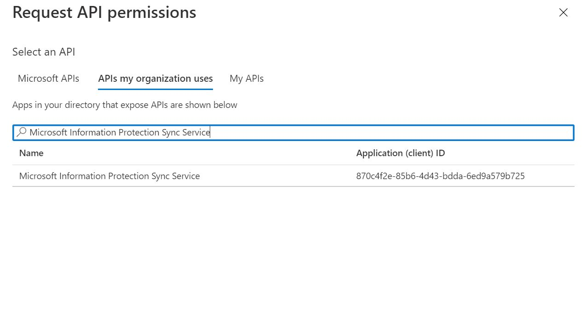

<page title="Discover (Hands On)" />

# Phase 1: Discover - File Repositories

In this section, we will run through the configuration of the AIP unified labeling scanner and show how it can be used to detect sensitive data on repositories.

---
## Azure Information Protection Scanner

Most modern organizations have terabytes (or petabytes) of unstructured data sitting in their on-premises data repositories and SharePoint libraries. Managing this data the way you manage other corporate resources is a daunting but achievable task using tools like the AIP scanner.

The **Azure Information Protection scanner** allows you to scan your on premises data repositories against the standard Office 365 sensitive information types and custom types you build with keywords or regular expressions. Once the data is discovered, the AIP scanner(s) can aggregate the findings and display them in Analytics reports so you can begin visualizing your data risk and see recommendations for setting up protection rules based on the content. As a quick clarification, this is the AIP Unified Labeling Scanner that is currently GA in the most up-to-date version we have.


We will quickly walk through the installation of the AIP unified labeling scanner in this lab, but we do the full end-to-end installation with multiple scanners attached to a single profile for load balancing in another lab in this series.

---
## AIP Scanner Configuration

In this task, we will configure a cluster, content scan job, and repository in Azure and install an AIP scanner to run unattended in discovery mode. 

1. Minimize **AdminPC** and return to Edge on the jumphost
1. Navigate to the Azure Portal and type in **Azure Information Protection** in the search bar to open up the respective tab.
2. On the side pane, under **Scanner**, click **Clusters**
3. In the Clusters tab, click the **+ Add** button.

4. In this **Add a new cluster pane**, enter **East US** for the **Cluster name** and click save.
5. In the side pane under the Scanner section, click on **Content scan jobs** and click the **+ Add** button.
6. Provide a name for the Content scan job and then configure using the following settings:

	>  The default **Schedule** is set to **Manual**, and **Info types to be discovered** is set to **All**.

1. Under **Policy Enforcement**, set the **Enforce** switch to **Off**
1. Click **Save** to complete initial configuration
1. Once the save is complete, click on **Configure repositories**
1. In the Repositories blade, click the **+ Add** button

1. In the Repository blade, under **Path**, type **\\\AdminPC\Documents**
1. In the Repository blade, click **Save**
	
	>NOTE: Keep the Azure Portal window available for future hands on sections.
1. On the desktop, restore **AdminPC** 
2. Open an **Administrative PowerShell Window** and type the PowerShell commands below.

	```PowerShell
	Install-AIPScanner -SqlServerInstance <name> -Profile <cluster name>
	```
	For name input the machine the SQL Server Instance is running on, which in this case is "**AdminPC**".
	For Profile type in the cluster name in quotations as well.
	
3. When prompted, log in using your scanner service account **Contoso\AIPScanner** (<domain\user name>)

4. Verify that the service is now installed by using **Administrative Tools > Services**. The installed service is named Azure Information Protection Scanner and is configured to run by using the scanner service account that you created.

Next we will be obtaining admin consent necessary to run the AIP client unattended. This will be done by obtaining an Azure AD Token. 

1. Navigate back to the Azure Portal and proceed to the **Azure Active Directory** Blade.

2. In the Azure Active Directory side pane, click **App Registrations**.

3. At the top, go ahead and click **+ New registration**.

4. In the Name section type in **AIPScanner**.

5. Leave **Supported account types** as default.

6. For the Redirect URI, leave the type as Web but type in **http://localhost** for the entry portion and click **Register**.

7. On the Overview page of this application, note down in your text editor of choice the following IDs: **Application (client) ID** and **Directory (tenant) ID**. You will need this later when setting up the Set-AIPAuthentication command.

8. On the side pane, navigate to **Certificates and Secrets**

9. Click on **+ New client secret**

10. In the dialog box that shows up, enter a description for your secret and set it to Expire **In 1 year** and then Add the secret.

11. You should see now under the client secrets section that there is an entry with the **Secret Value**. Go ahead and copy this value and store it in the file where you saved the Client ID and Tenant ID. This is the only time you will be able to see the secret value, it will not be recoverable if you don't copy it at this time. 

12. On the side pane, navigate to **API Permissions**

13. Go ahead and select **Add a permission**.

14. When the screen shows, select **Azure Rights Management Service**. Then select **Application Permissions**.


15. Click the drop down for **Content** and put checkmarks down for **Content.DelegatedReader** and **Content.DelegatedWriter**. Then at the bottom of the screen, click **Add Permissions**.


16. Navigate back the **API Permissions** section and add another permission.

17. This time, for the Select an API section, click on **APIs my organization uses**. In the search bar, type in **Microsoft Information Protection Sync Service** and select it.



18. Select **Application Permissions** and then in the **Unified Policy** drop down, checkmark the permission **UnifiedPolicy.Tenant.Read**. Then at the bottom of the screen, click **Add Permissions**.

19. Back on the **API Permissions** screen, click **Grant Admin Consent** and look for the operation being successful (signified by a green checkmark). 

20. Navigate back to the **Administrative PowerShell Window** in **AdminPC**

21. Type in the following command:
	```PowerShell
	$pscreds = Get-Credential Contoso\AIPScanner
	Set-AIPAuthentication -AppId "<CLIENTID>" -AppSecret "<SECRET>" -DelegatedUser aipscanner@contoso.com -TenantId "<TENANTID>" -OnBehalfOf $pscreds
	```
	For your $pscreds variable make sure to use your AD Domain name followed by the backslash with your local admin that is being used on your **AdminPC** machine. You will be prompted for the local account password so fill that in and hit enter.
	
	For your **-AppID** parameter input the **Application (Client) ID** you saved in a file earlier. Be sure to include the quotation marks. 
	
	For your **-AppSecret** parameter input the **Secret Value** that you saved in a file earlier. Be sure to include the quotation marks.
	
	For your **-DelegatedUser** parameter input the AAD synced or cloud-based service account you are using to manage AIP. You do not need quotation marks here.
	
	For your **-TenantID** parameter input the **Directory (Tenant) ID** that you saved in a file earlier. Be sure to include the quotation marks.
	
	Make sure to use $pscreds as the parameter for **-OnBehalfOf**.
	
	Run the command and if successful, you will receive the following message "**Acquired application access token on behalf of Contoso\AIPScanner.**"

You are now ready to run the scanner!

1. Finally, in the Admin PowerShell window, type **Start-AIPScan**

2. To check for the scanning status, type in the Admin PowerShell window **Get-AIPScannerStatus**

3. You can also check the scanner status in the AIP Blade in the Azure Portal by navigating to **Nodes** on the side pane.

This is an intentionally quick and simple deployment of the AIP scanner due to limited time in the lab environment.  After the script completes, a discovery scan is started and results will be reported to AIP Analytics if configured.  The image below shows the result of a discovery scan in the AIP Analytics dashboard.

>

---

In this section, we have learned how to do discovery on File repositories using the AIP scanner. 

In the next section, we will discuss classification and labeling and strategies for developing your classification taxonomy.

[Next - Phase 2: Classify and Label](3.classification.md)
