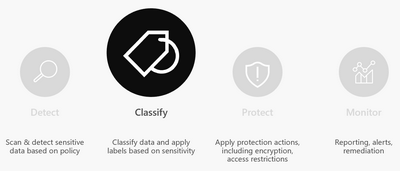
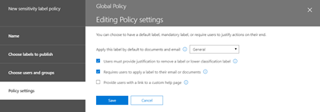
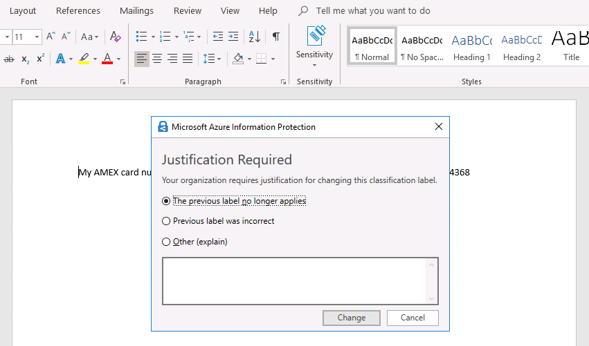

<page title="Phase 2: Classify and Label" />

# Phase 2: Classify and Label

One of the most common stall points for an AIP rollout is determining what classifications (labels) you want to deploy to your organization.  This can be a daunting task as it requires inputs from many distinct parts of the business (Senior Leadership, Legal, Security, Business Owners). Additionally, many organizations have a classification taxonomy that they have been using for many years (or even decades) so you must decide if you should continue using that or switch.

When deciding on a classification taxonomy we recommend keeping the following in mind:

- The classification taxonomy should identify the **confidentiality level** of the information. Based on the confidentiality level you can later decide what protection measures will be applied for each labeled document.

- A recommended classification taxonomy is one that **every information worker** in your organization will be able to order from least restrictive to most restrictive without any doubt. 

If your organization does not currently have a classification taxonomy or you are not confident that it is effective, Microsoft highly recommends using the classifications provided by default within AIP. These are detailed below with standard descriptions.

- **Non-Business\Personal** - Non-business data which does not belong to *Contoso*. Data is not encrypted and cannot be tracked or revoked. Do not use Non-Business to classify any personal data which is collected by or which belongs to *Contoso*. Such content should be classified as either Confidential or Highly Confidential

- **Public** - To be used for business data specifically prepared and approved for public consumption. Data is not Encrypted, and owners cannot track or revoke content using AIP.

- **General** - To be used for business data which is NOT meant for public consumption. However, this can be shared with internal employees, business guests and external partners as needed. Data is not Encrypted, and owners cannot track or revoke content using AIP.

- **Confidential** - To be used on sensitive business data which could cause business harm if over-shared. Recipients are trusted and get full delegation rights (including the ability to remove the Encryption). Data is protected using AIP and owners can track and revoke access.

- **Highly Confidential** - To be used on very sensitive business data which would certainly cause business harm if over-shared. Recipients do NOT get delegation rights (or rights to modify or remove the Encryption). Data is protected using AIP and owners can track and revoke access.

These classifications represent the top level labels in AIP. **Microsoft recommends using sub-labels for defining the audience and protection properties**.  We will discuss this in more detail in the **Protect and control access** section.

---
## Classify and label - Hands-On

Much of the groundwork for classification and labeling was laid in the discovery section when we generated the default label set and published the policy.  In this section, we will define policy settings for our global policy to make classification more effective and lower impact on your users.

### Defining Policy Settings

In this task, we will configure the standard policy settings for Default label, Mandatory labeling, and Downgrade justification in the Global policy as recommended by Microsoft.

1. Minimize **AdminPC**
2. In Edge, click on the Sensitivity labels tab to bring up the Microsoft Security Center
3. Under Label policies, click on **Global**
4. Scroll to the bottom of the Global pane and next to **Settings**, click **Edit**
5. On the Policy settings page, next to **Apply this label by default to documents and email**, select the drop-down menu and click **General**
10. Check the box next to **Users must provide justification to remove a label or lower classification label**
11. Check the box next to **Require users to apply a label to their email or documents**

	>The settings page should now look like the image below.  
	>
	>
	> 
	>These settings apply a default label to all documents and emails, requires users to justify any downgrade or removal of labels, and requires that all documents and email are labeled in some way.  These policies help to minimize the impact on users while still enabling classification of all documents and emails. 
	> 
	>Remember from discovery that you will still get analytics data on sensitive information found in documents even if they are labeled using the defualt General label. We will also add Recommendations to labels 
6. Click **Save** then **Close** to complete modification of the Global policy settings

---
## Testing Global Policy Settings

In this task, we will review the results of the settings we just enabled.

1. Restore **AdminPC** and close out of any Office applications (Word) to allow Word to get the latest policy from AIP
2. Open the test credit card document you created in the last section
3. Click the **Sensitivity** button and downgrade the label to **Public**
4. In the **Justification Required** dialog, select **The previous label no longer applies** and click **Change**

	>

5. **Save** the document
6. Create a **New blank document**
7. Click on the **Sensitivity** button and notice that **General** is already selected as the default label
    
	>Note that although you can modify the label, there is no option to delete the label. This is because it has been marked as mandatory in the policy.

---
In this section, we have discussed best practices and some of the reasons behind the classification taxonomy we recommend. We also tested the standard recommended policy settings.

In the next section, we will discuss protection and show the available settings and options for securing information with Azure Information Protection.
 
[Next - Phase 3: Protect and Control Access](4.Protect.md) 