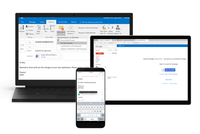

<page title="Phase 3: Protect and Control Access" />

# Phase 3: Protect and Control Access

One of the main reasons for the implementation of a classification tool is to apply protection to sensitive data. The dictionary defines **protect** as the ability “**to cover or shield from exposure, injury, [or] damage**”. 

In the auspices of data protection, AIP enables you to apply protection automatically as part of the configuration of each label. This can be in the form of **metadata and visual markings** that allow DLP and other systems to restrict the exposure of that data, or **metadata and markings plus actual encryption** provided by the protection service capabilities of AIP.  This encryption can **prevent unauthorized access to data** that could cause injury or damage to the organization.

When defining your classification taxonomy in the previous phase, you have created the portion of the taxonomy that specifies the confidentiality level.

Based on our real-world deployments, most organizations encrypt the top one or two sensitivity levels. For example, if using our default classification levels: Non-Business, Public, General, Confidential, Highly Confidential, the most common scenario is:

- **Non-Business** – not encrypted
- **Public** – not encrypted
- **General** – not encrypted
- **Confidential** – Protected with AIP encryption; with Full Control usage rights
- **Highly Confidential** – Protected with AIP encryption; with Viewer or Reviewer usage rights 

In the Protect phase, we must determine the type of protection that will be applied and who are the users that can access specific types of content. To address this need, we recommend using sub-labels to define the audience of the content and the usage rights available to that audience.

The first threat scenario organizations usually like to address is the outside threat/accidental leakage scenario. For this purpose, they configure a sub-label that applies protection with permissions for all employees in the organization. This effectively prevents all external users from accessing the data.

Another business scenario that we have seen at most of our customers is the ability to collaborate securely over email. Using the new capabilities of Office 365 Message Encryption we can now perform secure collaboration between business entities and social identities like Outlook, Yahoo, and Gmail.

The primary way of achieving this is by creating a Recipient only sub-label which applies protection (Do Not Forward) on emails and unprotected Word, PowerPoint, Excel, and PDF attachments for all the recipients in the recipients list. 

---
Knowing when **not to use encryption** is just as important as knowing when to use it.  There will be times where users **must share** Confidential and even Highly Confidential information with outside collaborators with no encryption applied (NDA, Audit, Compliance, Regulatory Filings). If you only have protected sub-labels under Confidential and Highly Confidential, you have given the information worker **no choice but to improperly classify the data** or remove classification entirely so that it can be shared. 

This results in **improperly or unclassified data** that defeats the purpose of using a classification system.  Because of this, we recommended creating another sub-label for sensitive data that is unencrypted (this is what we do at Microsoft). The main point that we stress is that **the confidentiality of data does not change** because it must be sent to a different audience.  Thus, the parent label (which we use to identify the confidentiality) **should also not change**.

After your content is classified (and optionally protected), you can track and control how it is used. You can analyze data flows to gain insight into your business, detect risky behaviors, and take corrective measures.  You can also track access to documents to help prevent data leakage or misuse. 

---

In this section, we have introduced protection concepts, common business use cases, and explored reasoning behind the way we have defined our labels and Microsoft and why we recommend these methods.

In the next section, we will delve deeper into protection and additional controls via scoped policies and advanced policy settings.

[Next - Phase 3: Protect and Control Access (Hands On)](6.ProtectHOL.md)