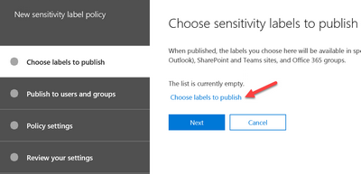
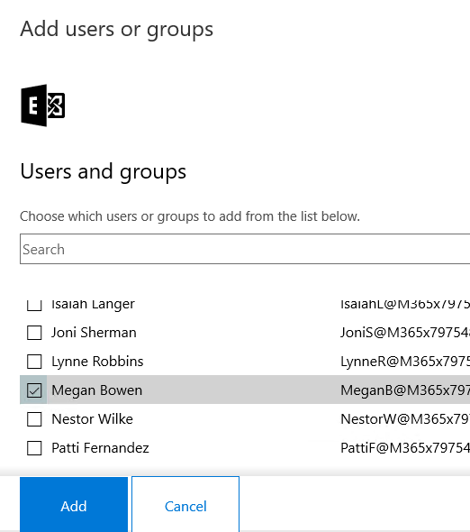
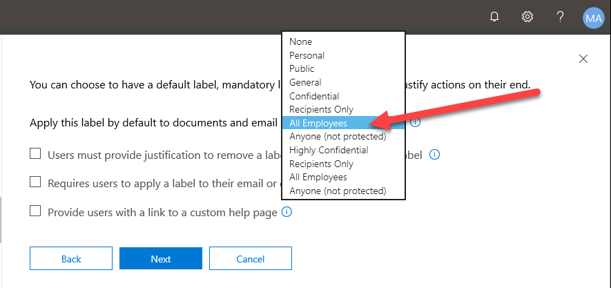
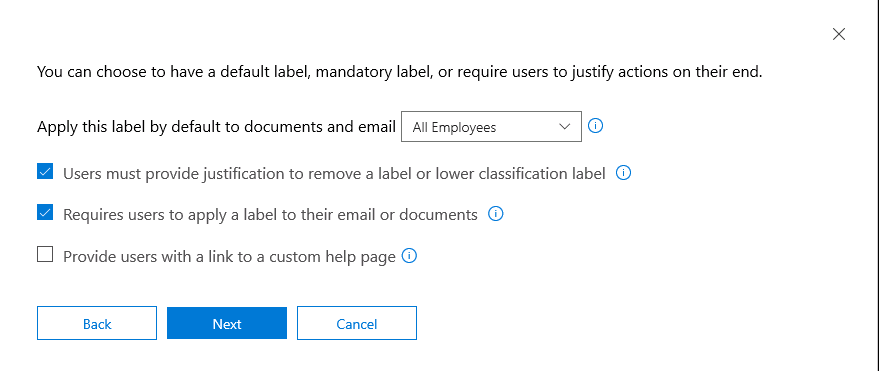
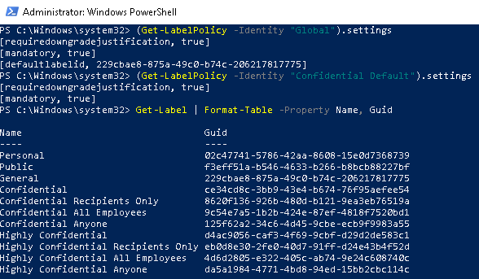
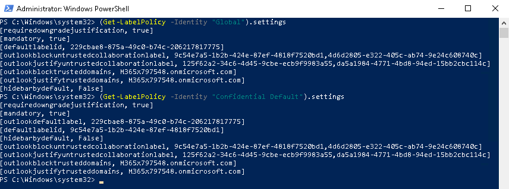

<page title="Protect and Control Access (Hands On)" />

# Phase 3: Protect and Control Access (Hands On)

In this section, we will add a scoped policy and discuss advanced AIP policy settings that can be used to provide convenience and additional control over your sensitive data.  

---
## Scoped Policies

Scoped policies can be used to add more restrictive settings to specific divisions that handle more sensitive information or may be used to perform production POC testing.  In this task, we will set up a scoped policy to create more restrictive default settings.

1. Minimize AdminPC and return to the Microsoft Security Center in Edge
2. Under Sensitivity Labels, click on the **Publish labels** button
3. In the New sensitivity label policy, click **Choose labels to publish**

	
1. In the Choose labels blade, click the **+ Add** button
1. In the Choose labels blade, check the box next to **Display name** to select all labels 

	>NOTE: Adding all labels again here may seem redundant, but because of how AIP processes order of precedence for label policies, this is necessary. 
5. Click the **Add** button and then **Done**
6. Click the **Next** button to select the scope of the policy (users or groups)
7. On the Publish these sensitivity labels page, next to Users and groups, click the **Choose users and groups** link
8. On the Add users or groups page, click the **+ Add** button
9. On the next Add users or groups page, check the box next to **Megan Bowen** 

	>
1. Click the **Add** button and then **Done**
1. On the Publish these sensitivity labels page, click the **Next** button
1. On the Policy settings page, next to **Apply this label by default to documents and email**, in the drop-down menu select the **All Employees** label below **Confidential**

	>
3. Check the boxes next to **Users must provide justification to remove a label or lower classification label** and **Require users to apply a label to their email or documents**

	>The settings page should now look like the image below.  
	>
	>
	> 
	>These settings require users to justify any downgrade or removal of labels, and requires that all documents and email are labeled in some way. Because we also assigned the **Confidential All Employees** label as the default label, this policy will have more impact on user behavior as they will have to consciously choose to downgrade any document that does not require encryption.  
	> 
	>While this is better for improving security, it could also impact user productivity.  This is a setting you will need to work with your business decision makers on to find the right balance of security and usability.  We will show advanced settings later that will help to mitigate this impact.
1. On the Policy settings page, name the policy **Confidential Default** and click the **Next** button
1. On the Review your settings page, click the **Publish** button

---
## Advanced Settings

Next we will add some Advanced settings using Security and Compliance Center PowerShell.	The common settings we will be adding here are **OutlookDefaultLabel**,**DefaultLabelID**,**DefaultSubLabel**, **OutlookJustifyUntrustedCollaborationLabel**, and **HideBarByDefault**. These are just a few of the many advanced settings available online at `https://docs.microsoft.com/en-us/azure/information-protection/rms-client/clientv2-admin-guide-customizations`.


To begin configuring AIP unified labeling client advanced settings, you must first connect to Security and Compliance Center PowerShell.  Follow the steps below to connect:

1. Open an **Administrative PowerShell** prompt
2. Type the code below to allow scripts to run and capture credentials as a variable
   
   	```PowerShell
	Set-ExecutionPolicy RemoteSigned
	```

	>Type Y when prompted

	```PowerShell
	$UserCredential = Get-Credential
   	```

   	>Provide the credentials below when prompted
   	> 
	> <copy>admin@<inject story-id="story://Content-Private/content/w-m365securityaip/m365shared" key="officeTenantName" copy="false" />.onmicrosoft.com</copy>
    >
    >**<inject story-id="story://Content-Private/content/w-m365securityaip/m365shared" key="officeTenantGAPassword"/>**

3. Run the command below to connect to SCC PowerShell
	
	```PowerShell
	$Session = New-PSSession -ConfigurationName Microsoft.Exchange -ConnectionUri https://ps.compliance.protection.outlook.com/powershell-liveid/ -Credential $UserCredential -Authentication Basic -AllowRedirection
	```

	```PowerShell
	Import-PSSession $Session -DisableNameChecking
	```
>WARNING: If you have **Multi-factor Authentication (MFA)** enabled in your tenant, you will need to connect to the Exchange/SCC PowerShell using the new Exchange cmdlet Connect-EXOPSSession.  Full details on this method can be found at `https://docs.microsoft.com/en-us/powershell/exchange/exchange-online/connect-to-exchange-online-powershell/mfa-connect-to-exchange-online-powershell?view=exchange-ps`

Now that you have connected to SCC PowerShell, you can run some commands to get information about the unified labeling configuration and labels.

1. In the SCC PowerShell window, type the commands below to get the current settings applied to the Global policy and to see a list of labels

	```PowerShell
	(Get-LabelPolicy -Identity "Global").settings
	```

	```PowerShell
	(Get-LabelPolicy -Identity "Confidential Default").settings
	```

	```PowerShell
	Get-Label | Format-Table -Property Name, Guid
	```

	>You should see output like the image below. Note that the settings in the global and scoped policies correspond to the ones set in the UI in the last task. The defaultlabelid also matches with the Guids of the General and Confidential All Employees labels.
	>
	>

2. Although encrypting all of the documents in a specific business unit may be justified or required, often encrypting all of those users' emails will have too high of an impact on business activities.  To reduce the user impact, we will use this advanced setting to create a separate default label for just Outlook.  In this case we are using the "Confidential \ Anyone (not protected)" label.  Type the commands below to add this setting.

	>Create variables to store the label id GUID

	```PowerShell
	$outlookdefaultlabel = (Get-Label -Identity "Confidential Anyone").Guid.Guid
	```

	>Set the Outlook Default Label to **Confidential Anyone** for the Confidential Default policy

	```PowerShell
	Set-LabelPolicy -Identity "Confidential Default" -AdvancedSettings @{OutlookDefaultLabel=$outlookdefaultlabel}
	```

	>Verify the outlook default label in policy settings

	```PowerShell
	(Get-LabelPolicy -Identity "Confidential Default").settings
	```
   
	>This setting is optional but is recommended because users typically create far more emails every day than documents.  Thus, even for policies that do not set a default label (or set a protected default label), setting an unprotected default label for email is commonly used to improve usability.

3. When you add a sublabel to a label, users can no longer apply the parent label to a document or email. By default, users select the parent label to see the sublabels that they can apply, and then select one of those sublabels. The settings below helps to improve this experience by allowing users to apply a default sublabel by clicking on the Confidential and Highly Confidential parent labels. In this case we are using this to set the protected "All Employees" sublables as the default, but you could just as easily set the "Anyone" label if you have not yet rolled out protection.

	>Create variables to store the label id GUIDs

	```Powershell
	$ConfidentialSub = (get-label -Identity "Confidential All Employees").guid.guid
	$HConfidentialSub = (get-label -Identity "Highly Confidential All Employees").guid.guid
	```

	>Set the default sublabels to the respective "All Employees" labels

	```Powershell
	Set-Label -Identity "Confidential" -AdvancedSettings @{defaultsublabelid=$ConfidentialSub}
	Set-Label -Identity "Highly Confidential" -AdvancedSettings @{defaultsublabelid=$HConfidentialSub}
	```

	>Verify the default sublabel in label settings

	```Powershell
	(Get-Label -Identity "Confidential").settings
	(Get-Label -Identity "Highly Confidential").settings
	```
 
4. You can use advanced settings to warn users against sending email to untrusted domains, justify that action, or block it entirely.  Using the advanced settings below, we will create justification dialogs for the "Anyone" sublabels and block sending "All Employees" messages to untrusted domains.  

	>Create variables to store the sublabel id GUIDs

	```PowerShell
	$ConfidentialSubAny = (get-label -Identity "Confidential Anyone").guid.guid
	$ConfidentialSubAll = (get-label -Identity "Confidential All Employees").guid.guid
	$HConfidentialSubAny = (get-label -Identity "Highly Confidential Anyone").guid.guid
	$HConfidentialSubAll = (get-label -Identity "Highly Confidential All Employees").guid.guid
	```

	>Add settings to Global policy

	```Powershell
	Set-LabelPolicy -Identity "Global" -AdvancedSettings @{OutlookBlockUntrustedCollaborationLabel="$ConfidentialSubAll,$HConfidentialSubAll"}
	
	Set-LabelPolicy -Identity "Global" -AdvancedSettings @{OutlookJustifyUntrustedCollaborationLabel="$ConfidentialSubAny,$HConfidentialSubAny"}

	Set-LabelPolicy -Identity "Global" -AdvancedSettings @{OutlookBlockTrustedDomains="<inject story-id="story://Content-Private/content/w-m365securityaip/m365shared" key="officeTenantName" copy="false" />.onmicrosoft.com"}
	
	Set-LabelPolicy -Identity "Global" -AdvancedSettings @{OutlookJustifyTrustedDomains="<inject story-id="story://Content-Private/content/w-m365securityaip/m365shared" key="officeTenantName" copy="false" />.onmicrosoft.com"}
	```

	>Add settings to Confidential Default policy
	
	```Powershell
	Set-LabelPolicy -Identity "Confidential Default" -AdvancedSettings @{OutlookBlockUntrustedCollaborationLabel="$ConfidentialSubAll,$HConfidentialSubAll"}
	
	Set-LabelPolicy -Identity "Confidential Default" -AdvancedSettings @{OutlookJustifyUntrustedCollaborationLabel="$ConfidentialSubAny,$HConfidentialSubAny"}

	Set-LabelPolicy -Identity "Confidential Default" -AdvancedSettings @{OutlookBlockTrustedDomains="<inject story-id="story://Content-Private/content/w-m365securityaip/m365shared" key="officeTenantName" copy="false" />.onmicrosoft.com"}
	
	Set-LabelPolicy -Identity "Confidential Default" -AdvancedSettings @{OutlookJustifyTrustedDomains="<inject story-id="story://Content-Private/content/w-m365securityaip/m365shared" key="officeTenantName" copy="false" />.onmicrosoft.com"}
	```

	>These settings prevent users from sending encrypted messages or attachments to users that will not be able to open them, and requires justification for any Confidential or Highly Confidential emails or attachments being sent to untrusted domains using the unencrypted Anyone sublabels. 
	>
	>The justification text is written to the email x-header, so that it can be read by other systems. For example, data loss prevention (DLP) services.

6. In the Azure Information Protection client (classic), the Information Protection bar in Office apps was displayed by defualt.  In the AIP unified labeling client, users must select the **Show Bar** option from the Sensitivity button to display this bar. 

	You can use the advanced setting below to automatically display this bar for users so that they can select labels from either the bar or the Sensitivity button.

	```PowerShell
	Set-LabelPolicy -Identity "Global" -AdvancedSettings @{HideBarByDefault="False"}
	Set-LabelPolicy -Identity "Confidential Default" -AdvancedSettings @{HideBarByDefault="False"}
	```

1. Run the commands below to verify that all settings have been properly added
	
	```PowerShell
	(Get-LabelPolicy -Identity "Global").settings
	```

	```PowerShell
	(Get-LabelPolicy -Identity "Confidential Default").settings
	```

	>The output should look similar to the image below
	>
	>
2. Run the command below to disconnect the remote PowerShell session when you are done modifying advanced settings.

	```PowerShell
	Remove-PSSession $Session
	```

As mentioned earlier, there are many more advanced settings available at `https://docs.microsoft.com/en-us/azure/information-protection/rms-client/clientv2-admin-guide-customizations` but these are some of the most common ones.  Later in this lab, we will test out these settings to see how they affect the clients.

---

In this section, we have added labels to the Global policy and discussed policy settings that can be used to provide convenience and additional control over your sensitive data.  

In the next section, we will delve into custom sensitive information type creation, and automated protection via label conditions.

[Next - Phase 3: Protect and Control Access (Hands On) - Automation](7.ProtectHOL2.md)
