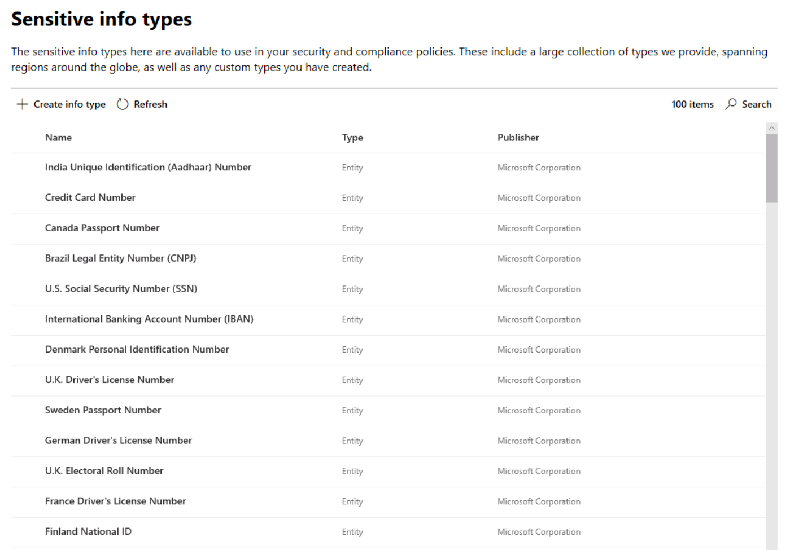
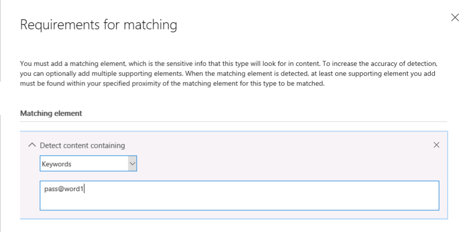
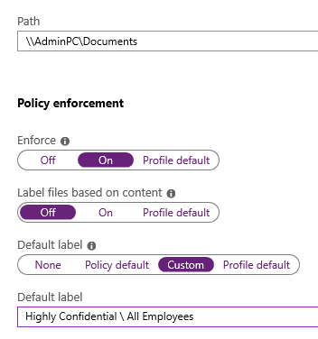

<page title="Protect and Control Access (Hands On) - Automation" />

# Phase 3: Protect and Control Access (Hands On) - Automation

In this section we will cover creating new sensitive information types via the Office 365 Security and Compliance Center, creating automatic conditions on labels, and show a simple way to use the AIP scanner to enforce protection on the previously defined repository.  These capabilities help to create automation mechanisms to help better protect your sensitive data.

---
## Creating Custom Sensitive Information Types

1. Return to the **Sensitivity labels - Microsoft 365 security** tab in Edge
5. Under **Classification** on the left, click on **Sensitive Info Types**

    >This shows a list of the 100 sensitive info types that microsoft provides out of the box for use in our online services.  These can be used to discover sensitive information using any services that use the Data Classification Service (some of these include the AIP unified labeling client, Office 365 DLP, and Microsoft Cloud App Security).
	
	>
6. Select **Create info type**

	>NOTE: In the Office 365 Security & Compliance Center you can create new sensitive info types.  We will step through the process of creating a new sensitive info type below. Because this is an introductory lab, we will only be defining a simple new sensitive info type to use in this lab.
	
7. In the **Name** and **Description** boxes, type **Password** and click **Next**
8. On the **Requirements for matching** page, under **Matching element**, click **+ Add an element**
9. Next, under **Detect content containing**, click **Any of these** and select the **Keywords** option from the drop-down list

	>Note that there are currently 3 options for content detection, **regular expression**, **keyword list**, and **dictionary**. If you click on any of these elements you can further define the criteria used for the new sensitive type. You also have the ability to set a **Confidence level** and **Character proximity** to fine tune matches for your custom type.
	
1. In the **Keywords** text box, enter **pass@word1**
   
	>
	
2. Click **Next** and **Finish**
3. In the Security & Compliance popup, click **No** to decline testing

---
## Defining Automatic Conditions

One of the most powerful features of Azure Information Protection is the ability to guide your users in making sound decisions around safeguarding sensitive data.  This can be achieved in many ways through user education or reactive events such as blocking emails containing sensitive data. 

However, helping your users to properly classify and protect sensitive data at the time of creation is a more organic user experience that will achieve better results long term.  In this task, we will define some basic automatic conditions that will trigger based on certain types of sensitive data.

1. Under **Classification** on the left, click **Sensitivity Labels**
2. Under **Confidential**, click on **All Employees**
3. Select **Edit Label**
4. Navigate to **"Auto-labeling for Office apps"** page by selecting the **Next** button
5. On the "Auto-labeling for Office apps" page, toggle **Auto labeling** to **On**
6. In the Detect content that contains section, click **+ Add a condition** and click **content contains**
7. In the Content contains section, click the **Add** drop-down and click **Sensitive info types**
8.  In the Sensitive info types panel, type **Credit** in the Search box
9.  Under Sensitive info types, check the box next to **Credit Card Number** and click **Add**
10. In the Sensitive info types panel, click **Done**
11. On the "Auto-labeling for Office apps" page, in the **Message displayed to user** text box, type **This file was automatically labeled as Confidential \ All Employees**
12. Click **Next**
13. Select **Submit** on the "Review your settings" page
14. On the "All Employees" page, click **Done**
15. Next, under **Highly Confidential**, click on **All Employees**
16. Select **Edit Label**
17. Navigate to "Auto-labeling for Office apps" page by selecting the **Next** button
18. On the "Auto-labeling for Office apps" page, toggle **Auto labeling** to **On**
19. In the Detect content that contains section, click **+ Add a condition** and click **content contains**
20. In the Content contains section, click the **Add** drop-down and click **Sensitive info types**
21. In the Sensitive info types panel, type **Password** in the Search box
22. Under Sensitive info types, check the box next to **Password** and click **Add**
23. On the "Auto-labeling for Office apps" page, in the **Message displayed to user** text box, type **This file was automatically labeled as Highly Confidential \ All Employees**

	>
21. Click **Next**
22. Click **Submit** on the "Review your settings" page
23. Click **Done**

---
## Exchange Online Information Protection Capabilities

Exchange Online can work in conjunction with Azure Information Protection to provide advanced capabilities for protecting sensitive data being sent over email.

In this task, we will configure a mail flow rule to detect sensitive information traversing the network in the clear and encrypt it using the Encrypt Only RMS Template.

1. Switch to AdminPC and in the **Administrative PowerShell** window, type **C:\Scripts\EncryptSensitiveMFR.ps1** and press **Enter**. 
2. Log in using your Global Admin credentials

	>This mail flow rule can be used to encrypt sensitive data leaving via email.  This can be customized to add additional sensitive data types. A breakdown of the command is listed below.
	>
	>New-TransportRule 
	>
	>-Name "Encrypt external mails with sensitive content" 
	>
	>-SentToScope NotInOrganization 
	>
	>-ApplyRightsProtectionTemplate "Encrypt" 
	>
	>-MessageContainsDataClassifications @(@{Name="ABA Routing Number"; minCount="1"},@{Name="Credit Card Number"; minCount="1"},@{Name="Drug Enforcement Agency (DEA) Number"; minCount="1"},@{Name="International Classification of Diseases (ICD-10-CM)"; minCount="1"},@{Name="International Classification of Diseases (ICD-9-CM)"; minCount="1"},@{Name="U.S. / U.K. Passport Number"; minCount="1"},@{Name="U.S. Bank Account Number"; minCount="1"},@{Name="U.S. Individual Taxpayer Identification Number (ITIN)"; minCount="1"},@{Name="U.S. Social Security Number (SSN)"; minCount="1"})

Although this script only has the defined sensitive information types shown above, you can add additional types either via PowerShell or directly via the Exchange Online Admin Center.

---
## AIP Scanner Enforcement

This section will cover enabling the AIP scanner to encrypt the contents of the previously configured repository.  

1. In Edge, switch to the **Azure Information Protection** tab
2. Under Scanner on the left, click **Profiles**
3. Click on the **East US** profile
4. Click **Configure repositories**
5. Next, click on the **\\\AdminPC\\Documents** repository
6. Under Policy Enforcement, set **Enforce** to **On**
7. Toggle **Label files based on content** to **Off**
8. Toggle **Default label** to **Custom**
9. In the **Default label** drop-down, select **Highly Confidential \\ All Employees**

    
10. Click **Save**
11. Close the **Repositories** blade and the **East US** profile blade

    >This has kicked off the encryption of all supported files in the configured repository.  We will review the results in the next section.

The AIP scanner is also capable of using content detection and automatic conditions for targeted encryption within repositories.  If you are interested in more details around the AIP scanner, please see the full AIP scanner lab in this series.

---
In this section we covered creating new sensitive information types via the Office 365 Security and Compliance Center, creating automatic conditions on labels, Exchange Online IRM capabilities, and showed a simple way to use the AIP scanner to enforce protection.

In the next section we will demostrate the results of the policy and protection actions taken in all of the previous sections.

[Next - Phase 3: Protect and Control Access (Hands On) - Testing](8.ProtectHOL3.md)