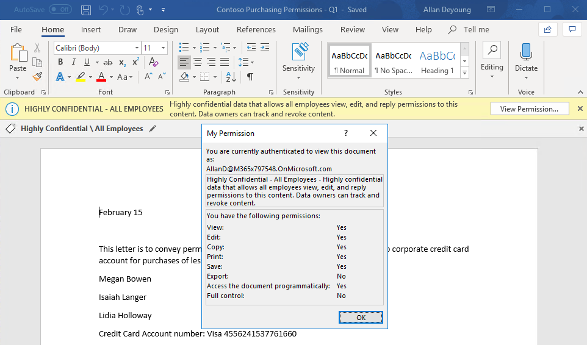

<page title="Protect and Control Access (Hands On) - Demo" />

# Phase 3: Protect and Control Access (Hands On) - Testing

In this section we will show the results of the settings configured in the previous hands on sections.


## Testing User Defined Permissions

One of the most common use cases for AIP is the ability to send emails using User Defined Permissions (Do Not Forward). In this task, we will send an email using the Do Not Forward label to test that functionality.


1. On the desktop, double-click on **VictimPC** and log in using the credentials below

    > **Contoso\JeffL**
    >
    > **Password$fun**	

1. Right-click on the desktop and create a **New Text Document**
2. Right-click on the New Text Document and click **Classify and protect**
3. In the Microsoft Azure Information Protection prompt, type **MeganB@yourdomain.onmicrosoft.com**
4. When prompted, type the password and Sign in
5. Close the Classify and protect dialog

	>NOTE: This process is only necessary to expedite logging into AIP. In a production environment, the client will use SSO tokens to download policy so the multiple logins in this lab will be unnecessary.  We will perform these steps for each of the test users in this lab.
7. Launch **Microsoft Outlook**, and in the username box, type **MeganB@yourdomain.onmicrosoft.com** and click **Connect**
8. When prompted, type the password and Sign in
9.  Once configuration completes, **uncheck the Box** to **Set up Outlook Mobile** and click **Done**.
10. In the Sign in to set up Office dialog, click **Sign in**
11. In the Activate Office dialog, type **MeganB@yourdomain.onmicrosoft.com** and click **Connect**.
12. When prompted, type the password and Sign in
13. Click on the **New email** button.

	> Note that the **Sensitivity** is set to **Confidential \ Anyone (not protected)** by default.
	
	>

14. Send an email to **Allan Deyoung** and **Alex Wilber** (```Allan Deyoung;Alex Wilber```). Also **add an external email address** (preferably from a major social provider like youremail@gmail, yahoo, or outlook.com) to test the external recipient experience. 
15. For the **Subject** and **Body** type **Test Recipients Only Email**

16. Click the drop-down arrow to the right of **Confidential**, select **Recipients Only**, and click **Send**

    >

17. Minimize VictimPC 
18. Double-click on **Client01C** and log in using the credentials below

    > **Contoso\LisaV**
    >
    > **HighImpactUser1!**	

19. Open **Outlook**
20. Run through setup, this time using **AllanD@yourdomain.onmicrosoft.com** 

    >Review the email in Allan Deyoung’s Outlook.  You will notice that the email is automatically shown in Outlook natively.

	>

---
## Testing Office 365 Message Encryption

Follow the steps below to review the Do Not Forward message in the Office 365 Message Encryption portal.

1. Minimize Client01C and log into your external mailbox
2. Click on the Test Recipients Only Email message
   
	>
	
1. Click on the **Read the message** button to launch the Office 365 Message Encryption portal
	
	>This may take a minute the first time you open a protected message

	>
	
1. You now have the option to either log in using the social identity provider (**Sign in with Google, Yahoo, Microsoft Account**), or to **sign in with a one-time passcode**.
1. If you choose the social identity provider login, it should use the token previously cached by the browser and display the message directly.
	
1. If you choose one-time passcode, you will receive an email like the one below with the one-time passcode.
	
	>
	
1. You may then use this code to authenticate to the Office 365 Message Encryption portal.
	
	>
	
1. After using either of these authentication methods, you will see a portal experience like the one shown below.
	
	>

	>NOTE: You may **Sign Out** of the OME portal to test the method you did not use previously.
---

## Testing Global Policy

In this task, we will create a document and send an email to demonstrate the functionality defined in the Global Policy.

1. Restore Client01C from the taskbar

3. Send an email to Megan Bowen, Alex Wilber, and yourself (```Megan Bowen;Alex Wilber;Your Email```).  
4. For the **Subject** and **Body** type **Test Contoso Internal Email**.

5. In the Sensitivity Toolbar, click on **Confidential** 

	>Note that clicking on **Confidential** automatically selects the **All Employees** sublabel due to the **DefaultSubLabelId** advanced setting used with this label.
6. Click **Send**

	>Note that sending of the email is blocked due to the **OutlookBlockUntrustedCollaborationLabel** advanced setting used on this policy. If we had not used this setting, the recipient would be unable to open this message.  This experience will vary depending on the client you use (the image below is from the Office 365 Message Encryption portal) but they should have similar messages after presenting credentials. This is not a good user experience, so we used the advanced client settings to prevent Internal labeled and protected messages from being sent to external users.
	
	>
1. Click **OK** and remove the external email address
2. Click **Send**
3. Minimize **Client01C** and restore **VictimPC**
   
   	>Observe that you are able to open the email natively in the Outlook client..

	>
   
---

## Testing Scoped Policy

In this task, we will create a document and send an email from one of the users in the Confidential Default scoped policy to demonstrate the functionality defined in the previous sections. 

1. Open **Microsoft Word**
2. Create a new **Blank document** and type **This is a test document** and **save the document**.

	>Note that the document was labeled as Confidential \ All Employees by default and is protected after initial save.

	>
3. Open **Microsoft Outlook**
4. Create a new email and send it to Alex Wilber, Allan Deyoung, and yourself (```Alex Wilber;Allan Deyoung;Your Email```).  
5. For the **Subject** and **Body** type **Test Justification Email**

	>Note that the Email default label is set to **Confidential \ Anyone (not protected)** because of the **OutlookDefaultLabel** advanced setting we set on this scoped policy.
6. Click **Send**

    >Note that you receive a **Justification Required** dialog because you added an external email address.
    >
  	>
7. In the justification dialog, type **Testing**
8. Click **Confirm and Send**

	> This setting still requires users of the scoped policy to justify sending Confidential information externally, but will not block them from sending the same way that the **Confidential \ All Employees** label that is default for documents would. This provides an opportunity for the user to reduce the classification level if appropriate or remove inappropriate users from the email.  If you use General or Public as the OutlookDefaultLabel, then the user would not be prompted for email.
   
---

## Testing Automatic Classification

In this task, we will test the configured automatic conditions we defined earlier.  Automatic conditions should be used after thorough testing or with items you are certain need to be protected. Although the examples used here are fairly simple, in production these could be based on complex regex statements or only trigger when a specific quantity of sensitive data is present.

1. Minimize **VictimPC** and restore **Client01C** 
2. Launch **Microsoft Word**.
3. In Microsoft Word, create a new **Blank document** and type **My AMEX card number is 344047014854133. The expiration date is 09/28, and the CVV is 4368** and **save** the document.

	> This card number is a fake number that was generated using the Credit Card Generator for Testing at ```https://developer.paypal.com/developer/creditCardGenerator/```.  The Microsoft Classification Engine uses the Luhn Algorithm to prevent false positives so when testing, please make sure to use valid numbers.

	>Notice that the document is automatically classified and protected with the **Confidential \ All Employees** label.
	
	>
1. In the same document, type **my password is pass@word1** and **save** the document.

	>Notice that the document is automatically classified and protected with the **Highly Confidential \ All Employees** label. Note that despite the Confidential \ All Employees banner still being present from the initial save, if you click on **View Permission...** it shows as Highly Confidential.  After closing and reopening the document, only the Highly Confidential markings will remain.
	
	>

---
## Demonstrating Exchange Online Mail Flow Rules

In this task, we will send emails to demonstrate the results of the Exchange Online mail flow rules we configured in the previous task.  This will demonstrate some ways to protect your sensitive data and ensure a positive user experience with the product.

1. Next, send an email to Alex Wilbur, Megan Bowen, and yourself (**Alex Wilbur;Megan Bowen;youremail**)
2. For the **Subject**, type **Test SSN Email**
3. For the **Body**, type **My Social Security Number (SSN) is 623-05-9743.  My date of birth is 5/25/90.**, then click **Send**

1. Minimize **Client01C** and restore **VictimPC**
6. Review the received email.

    > 

    > Note that there is no encryption applied to the message.  That is because we set up the rule to only apply to external recipients.  If you were to leave that condition out of the mail flow rule, internal recipients would also receive an encrypted copy of the message.  The image below shows the encrypted message that was received externally.

	>
	
	>


---
## Demonstrating AIP Scanner Enforcement

In the previous section, we used the AIP scanner to encrypt a repository.  We will now open one of those files to verify that it has been protected.

1. Next, navigate to **\\\AdminPC\documents**
	
2. Open one of the **Contoso Purchasing Permissions** documents

	>Note that the document has been classified and encrypted using the **Highly Confidential \ All Employees** label and All Employees are given Co-Author rights based on the settings in the label.

	>

---
In this section, we have shown the results of the settings configured in the previous hands on sections.  These included policy and label settings, Exchange mail flow rules, and AIP scanner enforcement.

In the next section, we will discuss the various options available for monitoring sensitive information.

[Next - Phase 4: Monitor and Remediate](9.monitor.md)
