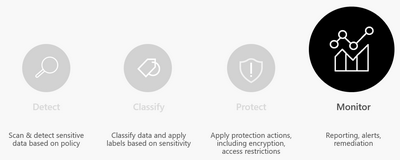
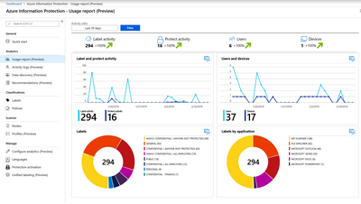
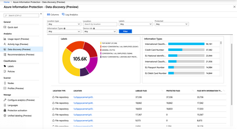
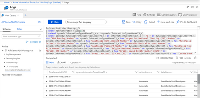
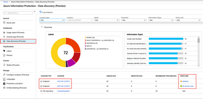

<page title="Phase 4: Monitor and Remediate" />

# Phase 4: Monitor and Remediate

The information protection lifecycle would not be complete without the ability to monitor the state of your sensitive data so you can respond to anomalous behavior. In this section, we will learn about the monitoring capabilities provided with AIP Analytics, Microsoft Defender ATP integration, and Microsoft Cloud App Security. We will then discuss alerts and remediation options available based on these detections.

## Azure Information Protection Analytics (Centralized Reporting)

AIP Analytics gives organizations insights into labeled and protected items across your organization. These insights consist of information protection audit events from Azure Information Protection clients, scanners, Microsoft Cloud App Security and devices running Microsoft Defender ATP (MDATP) on Windows 10.

To generate these reports, endpoints send the following types of information to Microsoft:

* The **label action**. For example, set a label, change a label, add or remove protection, automatic and recommended labels.

* The **label name** **before** and **after** the label action.

* Your organization's **tenant ID**.

* The **user ID** (email address or UPN).

* The **name** of the user's **device**.

* For **documents**: The **file path** and **file name** of documents that are labeled.

* For **emails**: The email **subject** and **email sender** for emails that are labeled.

* The **sensitive information types** (predefined and custom) that were **detected** in content.

* The Azure Information Protection **client version**.

* The client **operating system** version.

>NOTE: You can prevent Azure Information Protection clients from sending this data setting the policy setting **Send audit data to Azure Information Protection log analytics** to **Off** either the Global or a scoped policy.

The Usage report dashboard (shown below) provides information on the volume of labeled and protected documents and emails over time, label distribution of files by label type, and the applications used when the label was applied.

The data discovery dashboard provides information on the location of sensitive data within your organization, such as: location of documents labeled as confidential, data containing GDPR, PCI and other highly regulated information.

You can drill into file repositories (scanned by the Azure Information Protection scanner) to inspect where sensitive data resides, as well as what sensitive content they contain (such as financial info, PII or other information based on content inspection).

When the AIP client is installed on the endpoint, you can also see details about information protection actions being taken by users.  This includes details on what files are protected on the endpoint, downgrade or removal of labels, and attempted access to content they do not have rights to view.  Additionally, on Windows 10, Microsoft Defender ATP can provide integration between AIP labels and Windows Information Protection (WIP) enforcement actions .  These actions can prevent users from accidentally copying sensitive content from documents to unapproved applications like personal email or social media and warn or apply protection upon the transfer of sensitive files to USB devices. 

If you wish to inspect audit raw data, export the result to Excel or PowerBI, or write your own custom queries, you can do so by clicking on the Log Analytics icon from the dashboard. AIP audit log data can be accessed easily via the **InformationProtectionEvents** function. Azure Sentinel can also be used to aggregate and alert on these events, and Azure Monitor can be used to export these logs to 3rd party SIEM systems.

The InformationProtectionEvents log schema provides actionable insights to allow companies to set up alerts and repond to anomolous behavior.  The schema contains information on the elements as listed in the table below.

<table>
<thead>
<tr>
<th>Column Name</th>
<th>Description</th>
</tr>
</thead>
<tbody>
<tr>
<td>Time</td>
<td>Event time: UTC in format YYYY-MM-DDTHH:MM:SS</td>
</tr>
<tr>
<td>User</td>
<td>User: Format UPN or DOMAIN\USER</td>
</tr>
<tr>
<td>ItemPath</td>
<td>Full item path or email subject</td>
</tr>
<tr>
<td>ItemName</td>
<td>File name or email subject</td>
</tr>
<tr>
<td>Method</td>
<td>Label assigned method: Manual, Automatic, Recommended, Default, or Mandatory</td>
</tr>
<tr>
<td>Activity</td>
<td>Audit activity: DowngradeLabel, UpgradeLabel, RemoveLabel, NewLabel, Discover, Access, RemoveCustomProtection, ChangeCustomProtection, or NewCustomProtection</td>
</tr>
<tr>
<td>LabelName</td>
<td>Label name (not localized)</td>
</tr>
<tr>
<td>LabelNameBefore</td>
<td>Label name before change (not localized)</td>
</tr>
<tr>
<td>ProtectionType</td>
<td>Protection type [JSON] &quot;Type&quot;: [&quot;Template&quot;, &quot;Custom&quot;, &quot;DoNotForward&quot;], &quot;TemplateID&quot;: &quot;GUID&quot;</td>
</tr>
<tr>
<td>ProtectionBefore</td>
<td>Protection type before change [JSON]</td>
</tr>
<tr>
<td>InformationTypesMatches</td>
<td>JSON array of SensitiveInformation found in data where an empty array means no information types found, and null means no information available</td>
</tr>
<tr>
<td>MachineName</td>
<td>FQDN when available; otherwise host name</td>
</tr>
<tr>
<td>DeviceRisk</td>
<td>Device risk score from MDATP when available</td>
</tr>
<tr>
<td>Platform</td>
<td>Device platform (Win, OSX, Android, iOS)</td>
</tr>
<tr>
<td>ApplicationName</td>
<td>Application friendly name</td>
</tr>
<tr>
<td>AIPVersion</td>
<td>Version of the Azure Information Protection client that performed the audit action</td>
</tr>
<tr>
<td>TenantId</td>
<td>Azure AD tenant ID</td>
</tr>
<tr>
<td>AzureApplicationId</td>
<td>Azure AD registered application ID (GUID)</td>
</tr>
<tr>
<td>ProcessName</td>
<td>Process that hosts MIP SDK</td>
</tr>
<tr>
<td>LabelId</td>
<td>Label GUID or null</td>
</tr>
<tr>
<td>IsProtected</td>
<td>Whether protected: Yes/No</td>
</tr>
<tr>
<td>ProtectionOwner</td>
<td>Rights Management owner in UPN format</td>
</tr>
<tr>
<td>LabelIdBefore</td>
<td>Label GUID or null before change</td>
</tr>
<tr>
<td>InformationTypesAbove55</td>
<td>JSON array of SensitiveInformation found in data with confidence level 55 or above</td>
</tr>
<tr>
<td>InformationTypesAbove65</td>
<td>JSON array of SensitiveInformation found in data with confidence level 65 or above</td>
</tr>
<tr>
<td>InformationTypesAbove75</td>
<td>JSON array of SensitiveInformation found in data with confidence level 75 or above</td>
</tr>
<tr>
<td>InformationTypesAbove85</td>
<td>JSON array of SensitiveInformation found in data with confidence level 85 or above</td>
</tr>
<tr>
<td>InformationTypesAbove95</td>
<td>JSON array of SensitiveInformation found in data with confidence level 95 or above</td>
</tr>
<tr>
<td>DiscoveredInformationTypes</td>
<td>JSON array of SensitiveInformation found in data and their matched content (if enabled) where an empty array means no information types found, and null means no information available</td>
</tr>
<tr>
<td>ProtectedBefore</td>
<td>Whether the content was protected before change: Yes/No</td>
</tr>
<tr>
<td>ProtectionOwnerBefore</td>
<td>Rights Management owner before change</td>
</tr>
<tr>
<td>UserJustification</td>
<td>Justification when downgrading or removing label</td>
</tr>
<tr>
<td>LastModifiedBy</td>
<td>User in UPN format who last modified the file. Available for Office and SharePoint Online only</td>
</tr>
<tr>
<td>LastModifiedDate</td>
<td>UTC in format YYYY-MM-DDTHH:MM:SS: Available for Office &amp; SharePoint Online only</td>
</tr>
</tbody>
</table>

As you can see, this is a wealth of data points that can be used to set up alerts in Azure Sentinel or Azure Monitor.  We will show how to create an alert based on some of these values in the hands on part of this phase.

---
## Microsoft Defender Advanced Threat Protection Integration

When **Microsoft Defender ATP** is deployed to endpoints with the AIP client, additional information is sent to the AIP Analytics service related to **Device Risk**. This can assist you with identifying at risk systems and the sensitive content they contain and can help you to prioritize remediation efforts.

In the Activity logs report, you can filter by device risk to immediately identify systems that need remediation. In the details section of the Activity logs and Data discovery reports, you can click directly on the device risk to launch the Windows Security Center for the affected device.

>

Additionally, Microsoft Defender ATP uses sensitivity labels to identify sensitive files that need Windows Information Protection (WIP) policy applied on them. For example, a Microsoft Word document with a label of “Highly Confidential” that is on a Windows device can get protected with Windows Information Protection policy to prevent the inappropriate copying, sharing or transfer of that information to “non-work” locations on the device, such as personal email accounts or social media accounts.

---
In this section, we have discussed the monitoring capabilities of Azure Information Protection Analytics and discussed some additional capabilities provided for systems that have Microsoft Defender ATP installed. 

[Next - Phase 4: Monitor and Remediate (Hands On)](10.monitorHOL.md)
