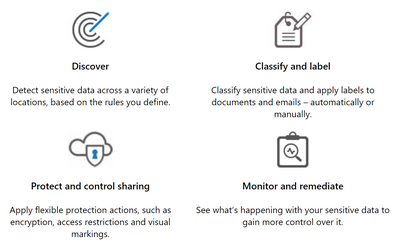

# Deploying Microsoft Information Protection Technologies to Protect Sensitive Data

Azure Information Protection (AIP) is a cloud-based solution that can help organizations to protect sensitive information by classifying and (optionally) encrypting documents and emails on Windows, Mac, and Mobile devices. This is done using an organization defined classification taxonomy made up of labels and sub-labels. These labels may be applied manually by users, or automatically by administrators via defined rules and conditions.

The phases of Information Protection lifecycle are shown in the graphic below.  

 

This lab will discuss an end-to-end Enterprise deployment scenario. We will discuss the **Discover**, **Classify and label**, **Protect and control access**, and **Monitor** phases of the Information Protection lifecycle. 

This lab is meant to be an interactive supplement to the AIP Deployment Acceleration Guide which can be downloaded at <copy>https://aka.ms/AIPDAG</copy>.  Although we will not get into low level details around deployment of clients, network firewalls, and end user training, this lab is meant to provide hands on experience with deploying AIP quickly with minimal impact on business productivity.

Objectives:

 - Learn about Microsoft Information Protection
 - Learn how to detect sensitive data across a variety of locations
 - Learn how to deploy the AIP unified labeling client and AIP scanner for Discovery
 - Learn how to develop a classification taxonomy that is simple to use and will accelerate deployment scenarios
 - Learn how to generate and deploy labels to clients 
 - Learn how to configure advanced policy configurations using Security and Compliance Center (SCC) PowerShell
 - Learn how to configure Exchange Online mail flow rules to control access to sensitive data
 - Learn about the monitoring, alerting and remediation capabilities available via AIP Analytics, Microsoft Sentinel, and Microsoft Defender Advanced Threat Protection

Expected Knowledge:

 - A basic understanding of AIP fundamentals including labels, policies, and scoped policy configuration
 - A basic understanding of Exchange Online administration
 - A basic understanding of PowerShell

Lab Environment:

These instructions are built for a lab environment containing 4 virtual machines.  The properties of these are listed below.

[Next - The Microsoft Information Protection Story](0.MIP.md)