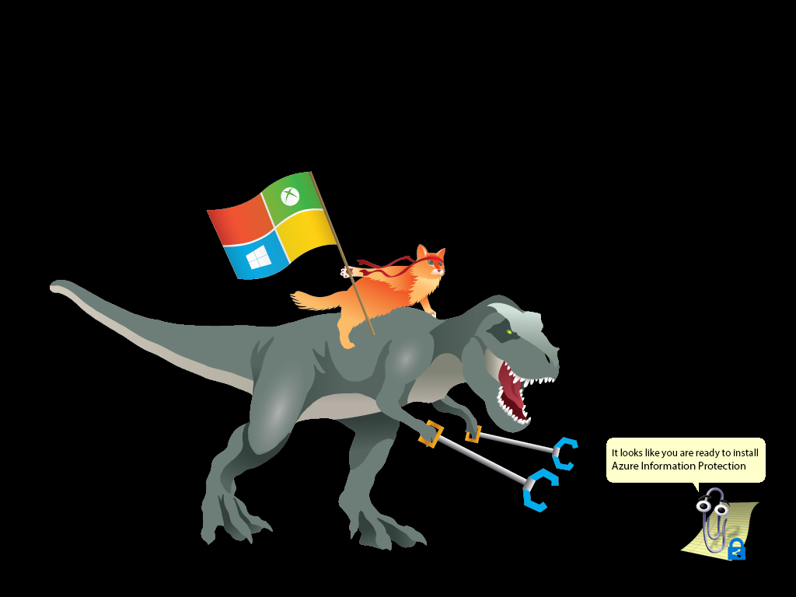

# Deploying Microsoft Information Protection Technologies to Protect Sensitive Data Lab Complete

Thank you for completing this lab! Throughout this lab we discussed an end-to-end Enterprise deployment scenario covering each of the phases of the Information Protection lifecycle. 

In this lab, we:

 - Learned about Microsoft Information Protection
 - Learned how to detect sensitive data across a variety of locations
 - Learned how to deploy the AIP client and AIP scanner for Discovery
 - Learned how to develop a classification taxonomy that is simple to use and can accelerate deployment scenarios
 - Learned how to generate and deploy labels to clients 
 - Learned how to configure advanced policy configurations in AIP policies
 - Learned how to configure Exchange Online mail flow rules to control access to sensitive data
 - Learned about the monitoring, alerting and remediation capabilities available via AIP Analytics, Microsoft Defender Advanced Threat Protection, and Azure Sentinel

This lab was designed to be an interactive supplement to the **AIP Deployment Acceleration Guide** which can be downloaded at **https://aka.ms/AIPDAG**.  

The AIP Deployment Acceleration Guide contains much of the same content, but goes into additional detail in each of the phases and links to resources that we did not include in this format due to time constraints.

If you have feedback about the AIP Deployment Acceleration Guide or the content of this lab experience, please fill out the form at **https://aka.ms/AIPDAGFeedback**
## Lab Complete
>
