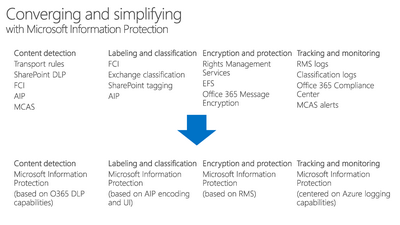

# Setting up your Lab Environment

**Azure Information Protection** (as described in the introduction) is one part of the larger **Microsoft Information Protection** story.  With Microsoft Information Protection, Microsoft is streamlining how all applications that require information protection capabilities interact.  This provides a **unified interface** where both Microsoft and Partner applications can **classify and protect sensitive information**. 

Ultimately, this means better integration across our information protection solutions and a more consistent approach to protecting your sensitive data.

 

The image below shows examples of technologies that can interface with Microsoft Information Protection. Although we will not delve deeply into all of these technologies in this lab, we will provide resources in the conclusion that may be used for further exposition.  

 

## Where to Begin

With General Availability of Unified Labeling clients and Sensitivity Labels in the Security and Compliance Center, there has been some confusion on where customers should start their deployment and which clients they should use. This is a common question, and one that requires understanding of the capabilities available in the Azure Information Protection client (classic) versus what is currently available in the Azure Information Protection Unified Labeling client. 
